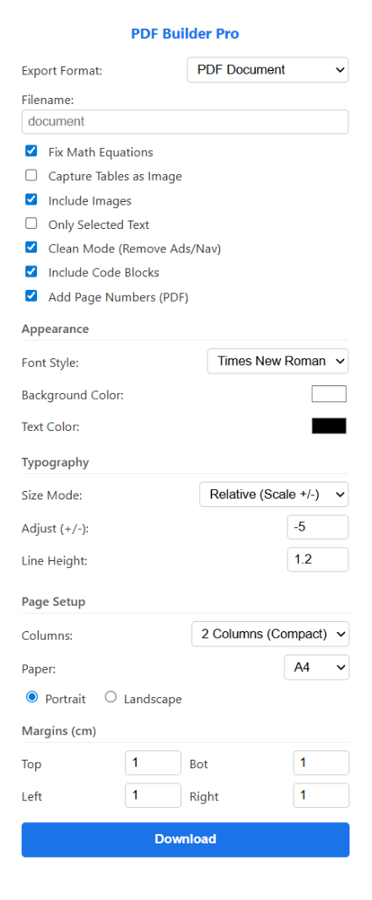
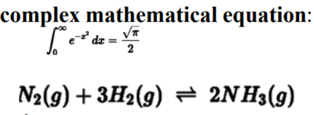
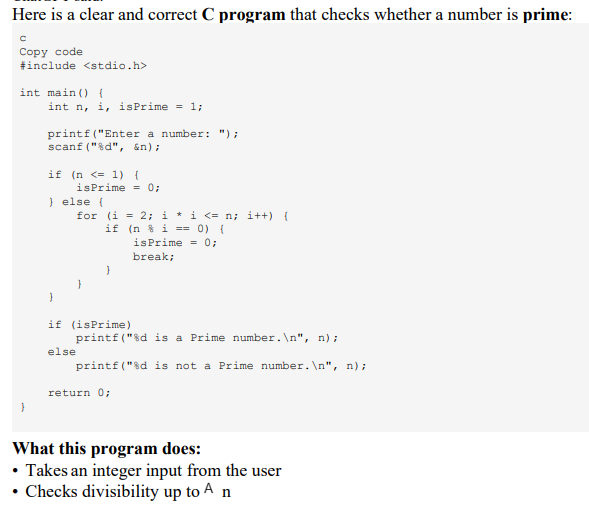
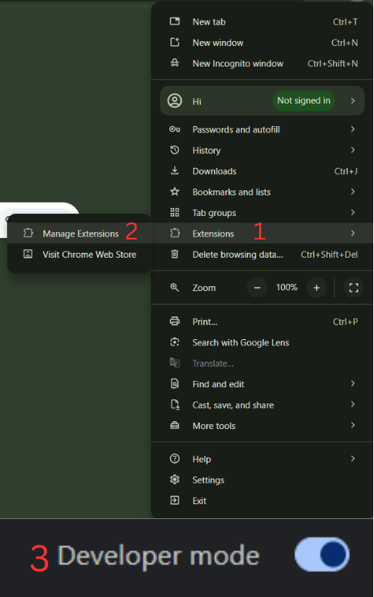
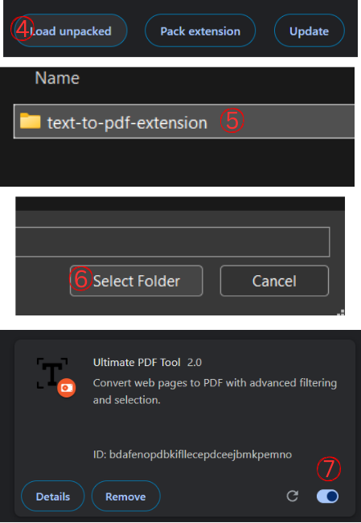

# PDF Builder Pro 🚀

**The Ultimate Web-to-PDF Converter for Developers & Students for Printout.** *Specialized support for Ai Chats, Math Equations, Code Blocks, and Complex Tables.*

  

## 🎯 The Goal: Print Smart, Save Hard.

We know that **Less Pages = Less Cost.** 💸

This extension was built with a singular mission: **Maximum density with zero clutter.** Unlike standard print dialogs that waste paper on massive margins, ads, and broken layouts, PDF Builder Pro intelligently compacts web content. It strips away the fluff and reformats text to fit more knowledge onto fewer sheets—saving you money on ink and paper while actually *improving* readability.

## 🌟 Why this extension?

Most PDF converters fail when they see complex web elements. They break math formulas, chop code blocks in half, and include annoying ads.

**PDF Builder Pro is different.** It uses a custom-built **Native Screenshot Engine** that takes high-resolution pictures of specific DOM elements (like MathJax equations, Chemistry formulas, and complex Tables) and embeds them directly into the PDF.

It guarantees that **if you can see it on your screen, it will look perfect in the PDF.**

## ✨ Key Features

### 1. 🧮 Native Math & Chemistry Support
Standard PDF printers turn math into gibberish. We automatically detect MathJax, KaTeX, and Chemistry formulas, take a high-DPI native screenshot, and erase the background so it fits perfectly on the page.

### 2. 💻 Smart Code Blocks
Code snippets are treated as first-class citizens.
- **Syntax Preservation:** Keeps the monospace font and formatting.
- **Smart Splitting:** If a code block is too long for one page, it cleanly splits and continues on the next page (no massive blank gaps!).

### 3. 🌓 Dark Mode "Magic Eraser"
Love using Dark Mode? No problem.
The extension intelligently analyzes screenshots of tables and formulas. It mathematically removes the dark background pixels and recolors the text to black, so your PDF looks clean and printable on white paper.

### 4. 🤖 Optimized for AI Chats (Ai)
- Auto-detects the chat title for the filename.
- Adds **"You:"** and **"Ai:"** speaker labels to the PDF.
- Removes UI clutter like "Thumbs Up", "Copy", and "Listen" buttons.

### 5. 📸 Visual Captures
- **Include Images:** Capture standard web images securely.
- **Tables as Images:** Optional toggle to snapshot complex tables instead of extracting text, preserving merged cells and colors.

---

## 📥 Installation Guide

Since this is an open-source developer tool, you can install it directly into Chrome or Edge/Brave.

### Step 1: Download the Code
1.  Clone this repository or download the ZIP file.
2.  Extract the files to a folder on your computer.

### Step 2: Open Extensions Menu
Open your browser and type `chrome://extensions` in the address bar.

### Step 3: Enable Developer Mode
Toggle the **"Developer mode"** switch in the top-right corner.

### Step 4: Load the Extension
Click the **"Load unpacked"** button in the top-left corner.

### Step 5: Select Folder
Select the folder where you extracted the project files.

**Done!** The extension icon will appear in your toolbar. Pin it for easy access! 📌

---

## 🛠 Tech Stack
- **JavaScript (ES6 Modules):** For clean, modular architecture (`scanner.js`, `pdf-generator.js`).
- **Chrome Extensions API:** specifically `captureVisibleTab` for the native screenshot engine.
- **jsPDF:** For generating the final PDF document.

## 🤝 Contributing
Contributions are welcome! If you find a bug or want to add a feature (like support for ChatGPT or Claude), feel free to fork the repo and submit a Pull Request.

1.  Fork the Project
2.  Create your Feature Branch (`git checkout -b feature/AmazingFeature`)
3.  Commit your Changes (`git commit -m 'Add some AmazingFeature'`)
4.  Push to the Branch (`git push origin feature/AmazingFeature`)
5.  Open a Pull Request

## 📄 License
Distributed under the MIT License. See `LICENSE` for more information.
